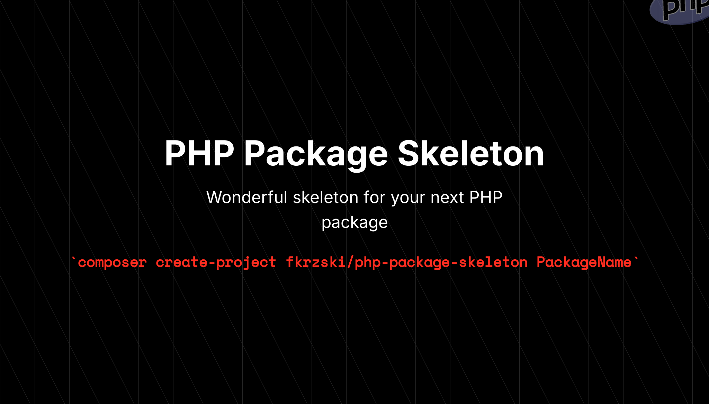

<p align="center">
    
</p>

------
This package provides a wonderful **PHP Package Skeleton** to start building your next PHP package.

**Requires [PHP 8.3+](https://php.net/releases/)**

⚡️ Create your package using [Composer](https://getcomposer.org):

```bash
composer create-project fkrzski/php-package-skeleton PackageName
```

🧹 Keep a modern codebase with **Pint**:
```bash
composer lint
```

✅ Run refactors using **Rector**
```bash
composer rector
```

🧪 Run type coverage checks using **PEST plugin**:
```bash
composer test:type-coverage
```

⚗️ Run static analysis using **PHPStan**:
```bash
composer test:types
```

✅ Run unit tests with code coverage using **PEST**
```bash
composer test:unit
```

🚀 Run the entire test suite:
```bash
composer test
```

**PHP Package Skeleton** was created by **[Filip Krzyżanowski](https://linkedin.com/in/fkrzski)** under the **[MIT license](https://opensource.org/licenses/MIT)**.
